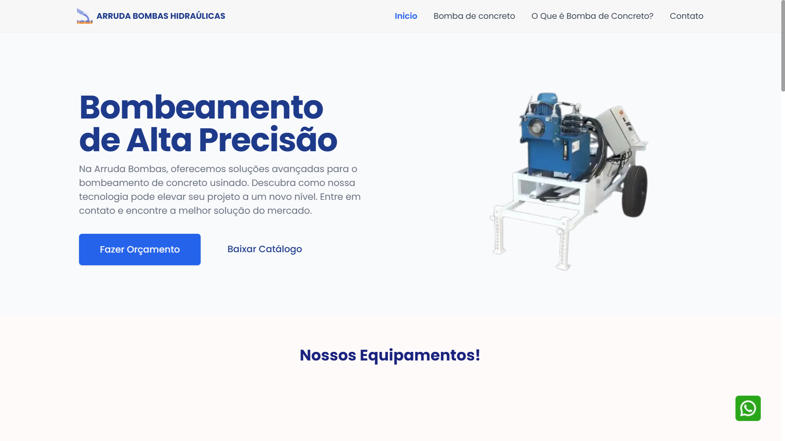

# Arruda Bombas Hidráulicas

Arruda Bombas Hidráulicas é uma plataforma dedicada à venda e fornecimento de bombas hidráulicas de alta qualidade. O site oferece uma interface intuitiva para que os usuários possam explorar diferentes modelos de bombas, obter informações detalhadas sobre cada produto e realizar compras de forma fácil e rápida.

Acesse o [site](https://arrudabombas.com.br/)

## Tecnologias Utilizadas:

- React.js: Para construção de interfaces interativas.
- Next.js: Para renderização do lado do servidor e otimização do - desempenho.
- Tailwind CSS: Para estilização responsiva e design moderno.

## Authors

- [@lazaroalvesr](https://github.com/lazaroalvesr)

## 🔗 Links

