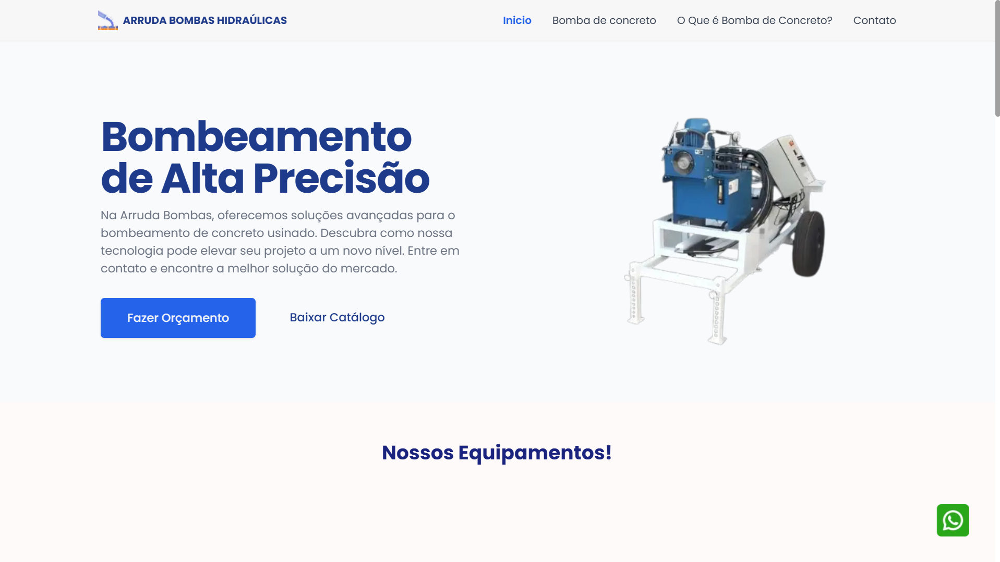

# Arruda Bombas Hidráulicas

Arruda Bombas Hidráulicas é uma plataforma dedicada à venda e fornecimento de bombas hidráulicas de alta qualidade. O site oferece uma interface intuitiva para que os usuários possam explorar diferentes modelos de bombas, obter informações detalhadas sobre cada produto e realizar compras de forma fácil e rápida.

Acesse o [site](https://arrudabombas.com.br/).

Este projeto utiliza o **next/font** para otimizar automaticamente a fonte Geist, uma família de fontes nova da Vercel. Além disso, utilizamos o **Motion** para animações suaves e dinâmicas, tornando a navegação mais interativa. O envio de formulários é feito através do **EmailJS**, permitindo que os usuários enviem mensagens diretamente do site sem a necessidade de configuração de um servidor backend.

## Tecnologias Utilizadas:

- **React.js**: Para construção de interfaces interativas.
- **Next.js**: Para renderização do lado do servidor e otimização do desempenho.
- **Tailwind CSS**: Para estilização responsiva e design moderno.
- **Motion**: Para animações dinâmicas e transições suaves.
- **EmailJS**: Para envio de formulários diretamente para o e-mail do administrador.

## Authors

- [@lazaroalvesr](https://github.com/lazaroalvesr)

## 🔗 Links

